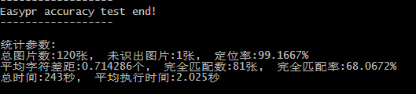
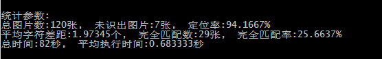
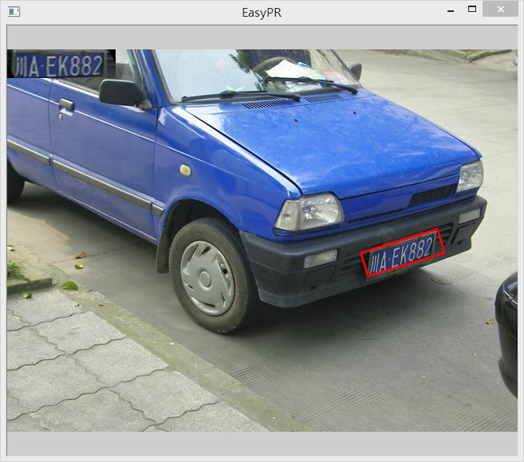
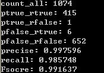
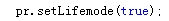
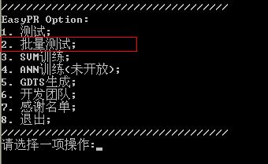
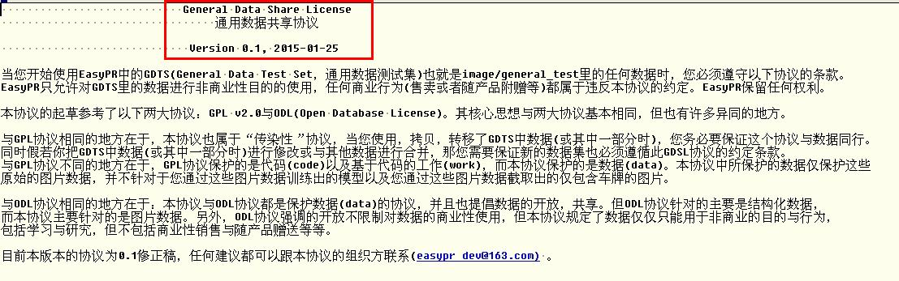
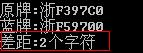
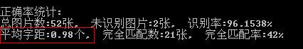

EasyPR版本更新

======

本次更新版本是1.6alpha版本，主要改进如下：

1. 采用灰度字符训练以及新的特征，使中文字符正确率上升到了86%，比上个版本提升了近14个百分点。

2. 借助于字符分割与识别算法的优化，在general_test上的完整识别率(0-error)从原先的59%首次上升到现在的70%，1-error则提升到了82%，提升巨大。

3. 在车牌判断模块中，使用了新的SVM特征（颜色+投影），从而在保持鲁棒性的同时，提升了正确率。定位指标中FScore从76%提升到82%.

4. 新增一种新的字符分割方法，groundMSER字符分割方法。

5. 提供了近万张中文字符灰度图数据供训练，并且在主界面中提供了一个方法从free大神的车牌集里提取中文与英文字符。

6. 提供了两万两千张的字符灰度图数据，供训练灰度字符模型使用。

7. 代码优化与升级，许多bug修复。

8. Opencv3.2版本的支持，编译前仅需要将config.h中将#define CV_VERSION_THREE_ZERO改为#define CV_VERSION_THREE_TWO即可。

9. 更加友好的linux与mac版本支持，使用CMake即可顺利编译，单独的utf-8与gbk的文件供分别的系统使用。

======

本次更新是EasyPR 1.5正式版本，相比beta版本有以下几点更新：

1.修正了SVM训练异常的问题！现在1.5版本也可以自由的使用SVM训练了。这个问题确实是opencv的bug，详见[讨论](https://github.com/opencv/opencv/issues/5054)，在此感谢 @tka 同学的告知。
注意，3.2的opencv也修正了这个问题，如果你用3.2版本的话，也可以。但是不清楚3.2版本是否会引入其他的问题，在目前的EasyPR版本里，即便用3.0或者3.1版本也可以规避训练异常的问题。

2.支持linux和mac编译，如果碰到问题请在issue里提问。

3.增加一个无需配置opencv的[懒人版](http://git.oschina.net/easypr/EasyPR/attach_files)。仅仅支持vs2013，也只能在debug和x86下运行，其他情况的话还是得配置opencv。感谢范文捷同学的帮助。页面里的两个文件都要下载，下载后用[7zip](http://www.7-zip.org/)解压。

其他的主要改进如下：

1.增加了一种新的基于文字定位的定位方法 (MSER), 在面对低对比度，低光照以及大图像上有较强的鲁棒性。

* 夜间的车牌图像

* 对比度非常低的图像

* 近距离的图像

* 高分辨率的图像

2.更加合理的评价协议。结合新增的GroundTruth文件与ICDAR2003的协议，使得整体评价指标更为合理。通用数据集里同时增加了近50张新图片。文字定位方法在面对这些复杂图片时比先前的SOBEL+COLOR的方法定位率提升了27个百分点。

实际运行时，使用了文字定位与颜色定位的结合，最终对256张的测试图片的测试结果如下：

3.使用了非极大值抑制算法去除相邻的车牌，使得最终输出变的合理。即便使用多个定位方法，最终也只会输出一个车牌，而且是可能性最大的车牌。

4.基于局部空间的大津阈值算法与自适应阈值算法，提升了文字分割与分子识别的准确率。

* 车牌图像

* 普通大津阈值结果

* 空间大津阈值结果

5.新的SVM模型与特征（LBP），提升了车牌判断的鲁棒性，新的中文ANN识别模型，提升了中文识别的整体准确率近15个百分点。

6.增加了Grid Search方法，可以进行自动调参。

7.首次增加了多线程支持，基于OpenMP的文字定位方法，在最终的识别速度上，比原先的单线程方法提高了接近2倍。

8.替换了一部分中文注释，使得windows下的visual studio在面对全部以LF结尾的文件时，也能成功通过编译。目前的程序只要opencv配置正确，gitosc上通过zip下载下来的程序可以直接通过编译并运行。

关于本次改动的具体内容可以看博客中的[介绍](http://www.cnblogs.com/subconscious/p/5637735.html)。

======

本次更新是1.4 正式版，主要改进在于几个方面：

1.代码统一为UTF-8格式，多平台的Shell不再出现乱码。

2.支持opencv3.0与3.1，注意，这与opencv2.x不兼容，要想支持的话请下载1.3版本。

3.ANN训练开放。

4.修正了SVM训练异常的问题。

5.代码优化。

不知道怎么下载以前的版本的小伙伴可以在github或gitosc的"branch"里选择"tags"，然后点击"v1.3"，再然后点击"download zip"。当然如果直接git clone的话可以随时方便切换。

在后面的版本中计划做以下几点改善：

1.新的评价框架，更加合理的评估数据。

2.新的车牌定位算法。

======

本次更新是1.3beta版，主要改进在于提升了字符识别模块的准确性：

平均字符差距从0.7降低到0.4，完整匹配度从68%左右上升到目前的81%，平均执行时间从2秒降低到1.5秒。见下图：

主要改动如下：

* 改进了字符识别算法，重新训练了ANN模型，从而使得字符识别准确率大幅度提升。

* 使用了更鲁棒性的办法提升了车牌定位模块的准确率。

目前版本的问题是处理时间还是偏高，1.3正式版本中会对这个问题进行fix。

======

本次更新是1.3alpha版，主要改进在于提升了字符识别模块的准确性：

平均字符差距从2.0降低到0.7，完整匹配度从25%左右上升到目前的68%。

同时，车牌定位模块准确率进一步提升，从上一个版本的94%上升到现在的99%。见下图：

主要改动如下：

* 改进了字符识别算法，重新训练了ANN模型，从而使得字符识别准确率大幅度提升。

* 使用了更鲁棒性的办法提升了车牌定位模块的准确率。

目前版本的问题是处理时间大幅度上升，1.3正式版本中会对这个问题进行fix。

======

本次更新是1.2版，主要改进在于提升了车牌定位模块的准确性，从70%左右到目前的94%，见下图：

主要改动如下：

* 车牌定位使用了“颜色信息”+“二次Sobel”的综合搜索方法。在下面的window中红框代表Sobel定位结果，黄框代表颜色定位结果。

* “批量测试”增加了一个结果查看window，这个窗口可以用SetDebug()方法开闭(true开，false关)。

* 基本攻克了“大角度定位”问题，下图的车牌被定位并转到了正确的视角。

* GDTS里新增了若干张新测试图，包括数张大角度图。

* “批量测试”结果现在同时会保存在“run_accuracy”文件中，可以查询历史信息。

* 与Linux版本做了整合，可以实现跨平台编译。

======

目前EasyPR的版本是1.1，相比上一个版本1.0，有以下更新（这次的更新内容较多，为了跟你现有的项目和代码不冲突，请
谨慎选择全部更新，最好新起一个目录试试新增的功能和内容）：

* 新的SVM模型。新模型使用rbf核替代了liner核，在车牌判断的准确率提升了8个百分点。

* 新增两个特征提取方法。并提供了相关的回调函数接口供二次开发。

* 新增Debug模式。可以在image/tmp文件夹下看到所有输出的中间图片。

* 增加了LifeMode模式，相比默认模式，更适合在生活场景下定位车牌。

* 增加了批量测试功能，这个功能可供测试EasyPR在多幅图片上的整体表现效果。

 

* 引入了GDTS(General Data Test Set，通用数据测试集)这个概念，作为EasyPR准确率的评测数据集。

* 为了确保GDTS的数据仅用于非商业目的，引入了新的[GDSL协议](../image/GDSL.txt)。

* 完善SVM训练功能。提供了一个方便简单的训练窗口。这些增加的功能是为了配合即将推出的SVM开发详解这篇文章。

* 强化SVM模型验证。使用了三个新的数据集概念，即learn data，train data，test data。

* 新增评价指标。引入Precise，Recall，FSocre三个指标这三个指标作为SVM模型准确率评判的参数与改善的依据。

* 新增整体指标。引入levenshtein距离作为EasyPR整体识别准确率误差的评判参数与改善依据。

  

* 大幅增加训练数据。SVM训练数据中增加了近千张新数据(未经直方图均衡化的车牌图片和非车牌图片)。

请自行解压train/data/plate_detect_svm/learn下的压缩文件查看相关信息。

* 新增命令行窗口，作为测试与训练的辅助工具。

注意：上一个版本中image文件下的test.jpg如果有同学下载了，请删除。它的格式不符合新的GDSL协议的约定。
如果想使用测试图片，可以使用1.1版本中新增的test.jpg替代。
