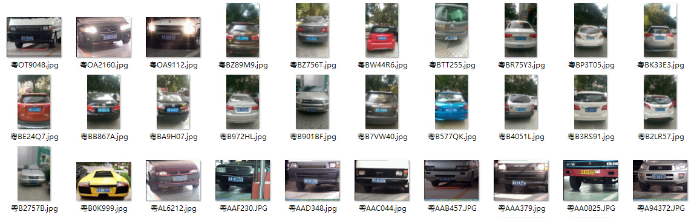
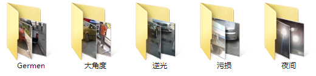
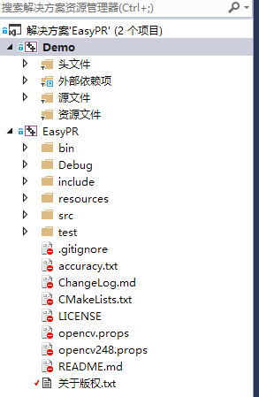

# EasyPR

EasyPR是一个中文的开源车牌识别系统，其目标是成为一个简单、高效、准确的车牌识别引擎。

相比于其他的车牌识别系统，EasyPR有如下特点：

* 它基于openCV这个开源库。这意味着你可以获取全部源代码，并且移植到opencv支持的所有平台。
* 它能够识别中文。例如车牌为苏EUK722的图片，它可以准确地输出std:string类型的"苏EUK722"的结果。
* 它的识别率较高。图片清晰情况下，车牌检测与字符识别可以达到80%以上的精度。

### 更新

本次更新是1.3 测试版，主要改进在于几个方面：

1.增加了50张左右的新图片。见下图：



2.增加了extreme_test文件夹，这里的图片以极端难处理情况为主。见下图：



3.重构了整体架构，将EasyPR核心以静态库的方式编译，分离出通用接口等等。此部分改善由Micooz贡献。见下图：



4.代码优化，提高易懂与可读性。

下个版本会正式发布1.3 正式版。

### 跨平台

目前除了windows平台以外，还有以下其他平台的EasyPR版本。一些平台的版本可能会暂时落后于主平台。

|版本 | 开发者 | 版本 | 地址 
|------|-------|-------|-------
| android |  goldriver  |  1.3  |  [linuxxx/EasyPR_Android](https://github.com/linuxxx/EasyPR_Android)
| linux | Micooz  |  1.3  |  已跟EasyPR整合
| ios | zhoushiwei |  1.3  |  [zhoushiwei/EasyPR-iOS](https://github.com/zhoushiwei/EasyPR-iOS)
| mac | zhoushiwei,Micooz |  1.3  | 已跟EasyPR整合
| java | fan-wenjie |  1.2  | [fan-wenjie/EasyPR-Java](https://github.com/fan-wenjie/EasyPR-Java)

### 兼容性

EasyPR是基于opencv2.4.8版本开发的，2.4.8以上的版本应该可以兼容，以前的版本可能会存在不兼容的现象。opencv3.0的版本还没有经过测试。

### 例子

假设我们有如下的原始图片，需要识别出中间的车牌字符与颜色：


经过EasyPR的第一步处理车牌检测（PlateDetect）以后，我们获得了原始图片中仅包含车牌的图块：


接着，我们对图块进行OCR过程，在EasyPR中，叫做字符识别（CharsRecognize）。我们得到了一个包含车牌颜色与字符的字符串：

“蓝牌：苏EUK722”

### 版权

EasyPR的源代码与训练数据遵循Apache v2.0协议开源。

EasyPR的resources/image/general_test文件夹下的图片数据遵循[GDSL协议](image/GDSL.txt)（通用数据共享协议）进行开放。

请确保在使用前了解以上协议的内容。

### 目录结构

以下表格是本工程中所有目录的解释:

|目录 | 解释
|------|----------
| src |  所有源文件
| include | 所有头文件
| test | 测试程序
| resources/model | 机器学习的模型
| resources/train | 训练数据与说明
| resources/image | 测试用的图片
| resources/doc | 相关文档

以下表格是resources/image目录中子目录的解释:

|目录 | 解释
|------|----------
| general_test | GDTS（通用数据测试集）
| native_test | NDTS（本地数据测试集）
| tmp | Debug模式下EasyPR输出中间图片的目录

以下表格是src目录中子目录的解释:

|目录 | 解释
|------|----------
| core |  核心功能
| preprocess | SVM预处理
| train | 训练目录，存放模型训练的代码
| util | 辅助功能

以下表格是src目录下一些核心文件的解释与关系:

|文件 | 解释
|------|----------
| plate_locate |  车牌定位
| plate_judge | 车牌判断
| plate_detect | 车牌检测，是车牌定位与车牌判断功能的组合
| chars_segment | 字符分割
| chars_identify | 字符鉴别
| chars_recognise | 字符识别，是字符分割与字符鉴别功能的组合
| plate_recognize | 车牌识别，是车牌检测与字符识别的共有子类
| feature | 特征提取回调函数
| plate | 车牌抽象
| core_func.h | 共有的一些函数

以下表格是test目录下文件的解释:

|文件 | 解释
|------|----------
| main.cpp | 主命令行窗口
| accuracy.hpp | 批量测试
| chars.hpp | 字符识别相关
| plate.hpp | 车牌识别相关

### 使用

EasyPR的所有源代码可在Github上的[项目主页](https://github.com/liuruoze/EasyPR)直接打包下载得到，如果你熟悉git版本控制工具，可以使用下面的命令来克隆代码：

```
$ git clone https://github.com/liuruoze/EasyPR
```

EasyPR支持当前主流的操作系统，通常不需要对源代码进行更改就可以编译运行，尽管如此，不同平台上IDE的配置也是有很大差异的，下面主要说明Windows，Linux以及Mac OS下的编译方法。

**Note**: 无论在哪个平台使用EasyPR，都要安装对应平台版本的[opencv](http://opencv.org/)，建议使用正式稳定版本。

#### Windows

Windows下的配置以Visual Studio 2013为例，其他版本大同小异。

* 打开项目目录下的解决方案文件`EasyPR.sln`。

**Note**: 该解决方案会加载两个项目，一个是`EasyPR`，用于编译src/下的源文件生成静态库`libeasypr.lib`；另一个是`Demo`，用来编译test/下的main.cpp，并链接libeasypr.lib生成可执行程序。

* 配置OpenCV库

OpenCV for Windows通常会将使用VS编译好二进制文件放到`opencv\build\`目录下。

EasyPR两个项目的Debug和Release模式都会引用opencv.props属性表，用属性表管理器打开，修改用户宏里面的`OpenCV`项，使之指向你的OpenCV的build目录。

**Note**: 如果你使用的opencv版本不是`2.4.11`，请修改属性表下的`链接器`-`输入`-`附加依赖项`，调整为对应版本的lib。

**Note**: 如果你要使用X64的opencv库或者其他版本的VS，请修改`链接器`-`常规`-`附加库目录`，调整为对应的版本。

* 生成解决方案

默认情况下，生成出现的`libeasypr.lib`和`easypr_test.exe`会放在`bin\debug(release)`下。

**Note**: 直接双击运行程序会出现找不到opencv动态库的情况，这个时候只需要在`opencv\build\x86(x64)\vc(..)\bin`下找到缺失的dll放到执行目录即可。

#### Linux & Mac OS

EasyPR使用CMake在Linux及Mac OS下进行构建，确保系统安装了最新版本的[CMake](http://cmake.org)，然后在任意目录(将存放编译所需的Makefile)执行：

```
$ cmake path/to/EasyPR
```

完成后在同一目录下执行编译命令：

```
$ make
```

CMake将首先把EasyPR/src下的源文件编译打包为静态库`libeasypr.a`，然后编译`test/main.cpp`，链接静态库生成可执行程序`easypr_test`。

-----

**Note**: *你可以直接利用EasyPR/include和这个静态库来调用EasyPR提供的函数接口编写自己的程序。*

运行Demo：

```
$ ./easypr_test // 进入菜单交互界面
$ ./easypr_test ? // 查看CLI帮助
```

### 命令行示例

可以向`easypr_test[.exe]`传递命令行参数来完成你想要的工作，目前Demo支持四个子命令，其他功能如字符识别将逐步加入。对于每个子命令的帮助信息可以传入`-h`参数来获取。

**车牌识别**

```
# 利用提供的SVM和ANN模型来识别一张图片里面的所有车牌
$ ./easypr_test recognize -p resources/image/plate_recognize.jpg --svm resources/model/svm.xml --ann resources/model/ann.xml
# 或者更简单一些(注意模型路径)
$ ./easypr_test recognize -p resources/image/plate_recognize.jpg
```

**SVM训练**

```
# 首先生成训练用图片
$ ./easypr_test svm --create --in raw/ --out learn/
# 接下来给训练用图片打标签，自动把“是”车牌的图块放到has/，“不是”车牌的图块放到no/里，注意这里要使用svm.xml的原因是为了简化你的分类工作量，你也可以手动对图块分类
$ ./easypr_test svm --tag --source=learn/ --has=has/ --no=no/ --svm=resources/model/svm.xml
# 接下来就是训练过程了，--divide意味着训练程序会对两个目录下的图块进行划分，默认是70%的训练数据，30%的测试数据，分别放在
# has/train(70%), has/test; 
# no/train(70%), no/test
# Note: 目前你需要自己建立子目录
$ ./easypr_test svm --train --has-plate=has/ --no-plate=no/ --divide --svm=save/to/svm.xml
```

详细的开发与教程请见[介绍与开发教程](http://www.cnblogs.com/subconscious/p/3979988.html)。

如果你在使用过程中遇到任何问题，请在[这里](https://github.com/liuruoze/EasyPR/issues)告诉我们。

### Contributors

* liuruoze：1.0-1.2版作者，1.3版整合工作

* 海豚嘎嘎：1.3alpha-beta版主要贡献者，提升了车牌定位与字符识别的准确率

* Micooz：架构优化，代码重构，linux与mac的跨平台编译等

* jsxyhelu：deface版本一

* zhoushiwei：deface版本二

* ahccom：新的plateLocate函数

* 阿水：1.3版整合，数据标注等工作

### 鸣谢

taotao1233，邱锦山，唐大侠，jsxyhelu，如果有一天(zhoushiwei)，学习奋斗，袁承志，

圣城小石匠，goldriver，Micooz，梦里时光，Rain Wang，任薛纪，ahccom，星夜落尘，海豚嘎嘎