# EasyPR

EasyPR是一个开源的中文车牌识别系统，其目标是成为一个简单、高效、准确的车牌识别库。

相比于其他的车牌识别系统，EasyPR有如下特点：

* 它基于openCV这个开源库。这意味着你可以获取全部源代码，并且移植到opencv支持的所有平台。
* 它能够识别中文。例如车牌为苏EUK722的图片，它可以准确地输出std:string类型的"苏EUK722"的结果。
* 它的识别率较高。图片清晰情况下，车牌检测与字符识别可以达到80%以上的精度。

### 更新

当前master分支下的版本有以下几点更新：

1.支持linux和mac编译，如果碰到问题请在issue里提问。

2.增加一个无需配置opencv的[懒人版](http://git.oschina.net/easypr/EasyPR/attach_files)。仅仅支持vs2013，也只能在debug和x86下运行，其他情况的话还是得配置opencv。感谢范文捷同学的帮助。页面里的两个文件都要下载，下载后用[7zip](http://www.7-zip.org/)解压。

本次更新是EasyPR 1.5beta版本，主要改进如下：

1.增加了一种新的基于文字定位的定位方法 (MSER), 在面对低对比度，低光照以及大图像上有较强的鲁棒性。

* 夜间的车牌图像

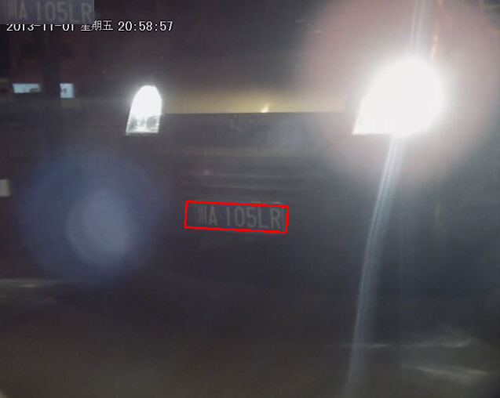

* 对比度非常低的图像

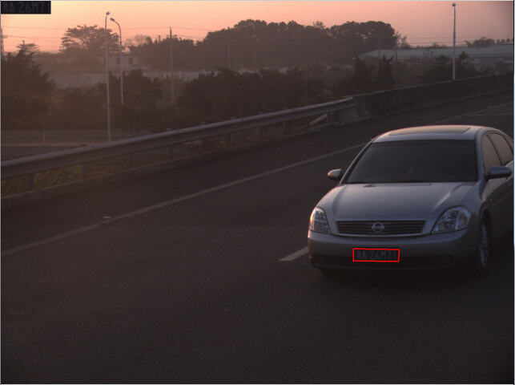

* 近距离的图像

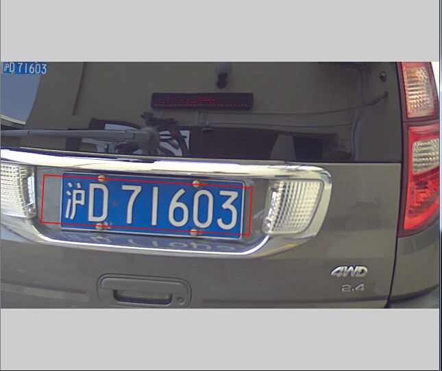

* 高分辨率的图像

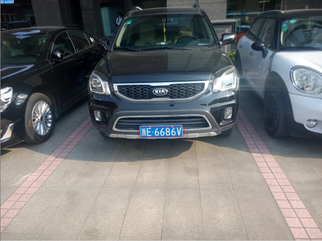

2.更加合理的评价协议。结合新增的GroundTruth文件与ICDAR2003的协议，使得整体评价指标更为合理。通用数据集里同时增加了近50张新图片。文字定位方法在面对这些复杂图片时比先前的SOBEL+COLOR的方法定位率提升了27个百分点。

实际运行时，使用了文字定位与颜色定位的结合，最终对256张的测试图片的测试结果如下：

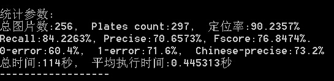

3.使用了非极大值抑制算法去除相邻的车牌，使得最终输出变的合理。即便使用多个定位方法，最终也只会输出一个车牌，而且是可能性最大的车牌。

4.基于局部空间的大津阈值算法与自适应阈值算法，提升了文字分割与分子识别的准确率。

* 车牌图像

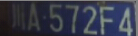

* 普通大津阈值结果

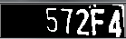

* 空间大津阈值结果

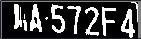

5.新的SVM模型与特征（LBP），提升了车牌判断的鲁棒性，新的中文ANN识别模型，提升了中文识别的整体准确率近15个百分点。

6.增加了Grid Search方法，可以进行自动调参。

7.首次增加了多线程支持，基于OpenMP的文字定位方法，在最终的识别速度上，比原先的单线程方法提高了接近2倍。

8.替换了一部分中文注释，使得windows下的visual studio在面对全部以LF结尾的文件时，也能成功通过编译。目前的程序只要opencv配置正确，gitosc上通过zip下载下来的程序可以直接通过编译并运行。

关于本次改动的具体内容可以看博客中的[介绍](http://www.cnblogs.com/subconscious/p/5637735.html)。

注意，目前1.4和1.5版的SVM训练好的文件在使用时会有问题，这个原因可能跟opencv3的实现改变有关。建议要训练SVM的话使用基于opencv2的1.3版。

### 跨平台

目前除了windows平台以外，还有以下其他平台的EasyPR版本。一些平台的版本可能会暂时落后于主平台。

|版本 | 开发者 | 版本 | 地址 
|------|-------|-------|-------
| android |  goldriver  |  1.4  |  [linuxxx/EasyPR_Android](https://github.com/linuxxx/EasyPR_Android)
| linux | Micooz  |  1.5  |  已跟EasyPR整合
| ios | zhoushiwei |  1.3  |  [zhoushiwei/EasyPR-iOS](https://github.com/zhoushiwei/EasyPR-iOS)
| mac | zhoushiwei,Micooz |  1.5  | 已跟EasyPR整合
| java | fan-wenjie |  1.2  | [fan-wenjie/EasyPR-Java](https://github.com/fan-wenjie/EasyPR-Java)

### 兼容性

当前EasyPR是基于opencv3.0版本开发的，3.0及以上的版本应该可以兼容，以前的版本可能会存在不兼容的现象。

### 例子

假设我们有如下的原始图片，需要识别出中间的车牌字符与颜色：


经过EasyPR的第一步处理车牌检测（PlateDetect）以后，我们获得了原始图片中仅包含车牌的图块：

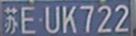

接着，我们对图块进行OCR过程，在EasyPR中，叫做字符识别（CharsRecognize）。我们得到了一个包含车牌颜色与字符的字符串：

“蓝牌：苏EUK722”

### 示例

EasyPR的调用非常简单，下面是一段示例代码:
```c++
	CPlateRecognize pr;
	pr.setResultShow(false);
	pr.setDetectType(PR_DETECT_CMSER);
     
	vector<CPlate> plateVec;
	Mat src = imread(filepath);
	int result = pr.plateRecognize(src, plateVec);
```

我们首先创建一个CPlateRecognize的对象pr，接着设置pr的属性。

```c++
	pr.setResultShow(false);
```

这句话设置EasyPR是否打开结果展示窗口，如下图。设置为true就是打开，否则就是关闭。在需要观看定位结果时，建议打开，快速运行时关闭。

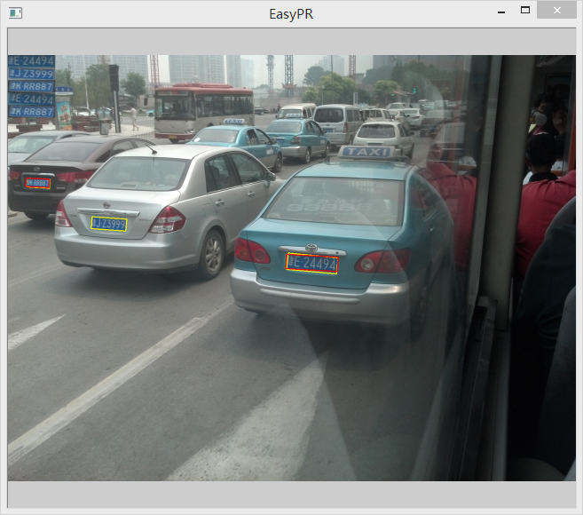

```c++
	pr.setDetectType(PR_DETECT_CMSER);
```

这句话设置EasyPR采用的车牌定位算法。CMER代表文字定位方法，SOBEL和COLOR分别代表边缘和颜色定位方法。可以通过"|"符号结合。

```c++
	pr.setDetectType(PR_DETECT_COLOR | PR_DETECT_SOBEL);
```

除此之外，还可以有一些其他的属性值设置：

```c++
	pr.setLifemode(true);
```

这句话设置开启生活模式，这个属性在定位方法为SOBEL时可以发挥作用，能增大搜索范围，提高鲁棒性。

```c++
	pr.setMaxPlates(4);
```

这句话设置EasyPR最多查找多少个车牌。当一副图中有大于n个车牌时，EasyPR最终只会输出可能性最高的n个。

下面来看pr的方法。plateRecognize()这个方法有两个参数，第一个代表输入图像，第二个代表输出的车牌CPlate集合。

```c++
	vector<CPlate> plateVec;
	Mat src = imread(filepath);
	int result = pr.plateRecognize(src, plateVec);
```

当返回结果result为0时，代表识别成功，否则失败。

CPlate类包含了车牌的各种信息，其中重要的如下：

```c++
	CPlate plate = plateVec.at(i);
	Mat plateMat = plate.getPlateMat();
	RotatedRect rrect = plate.getPlatePos();
	string license = plate.getPlateStr();
```

plateMat代表车牌图像，rrect代表车牌的可旋转矩形位置，license代表车牌字符串，例如“蓝牌：苏EUK722”。

这里说下如何去阅读如下图的识别结果。

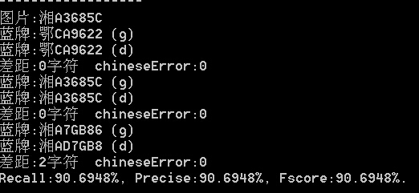

第1行代表的是图片的文件名。

第2行代表GroundTruth车牌，用后缀（g）表示。第3行代表EasyPR检测车牌，用后缀（d）表示。两者形成一个配对，第4行代表两者的字符差距。

下面同上。本图片中有3个车牌，所有共有三个配对。最后的Recall等指标代表的是整幅图片的定位评价，考虑了三个配对的结果。

有时检测车牌的部分会用“无车牌”与“No string”替代。“无车牌”代表“定位不成功”，“No string”代表“定位成功但字符分割失败”。

### 版权

EasyPR的源代码与训练数据遵循Apache v2.0协议开源。

EasyPR的resources/image/general_test文件夹下的图片数据遵循[GDSL协议](image/GDSL.txt)（通用数据共享协议）进行开放。

请确保在使用前了解以上协议的内容。

### 目录结构

以下表格是本工程中所有目录的解释:

|目录 | 解释
|------|----------
| src |  所有源文件
| include | 所有头文件
| test | 测试程序
| etc | 中文字符映射表
| resources/model | 机器学习的模型
| resources/train | 训练数据与说明
| resources/image | 测试用的图片
| resources/doc | 相关文档

以下表格是resources/image目录中子目录的解释:

|目录 | 解释
|------|----------
| general_test | GDTS（通用数据测试集）
| native_test | NDTS（本地数据测试集）
| tmp | Debug模式下EasyPR输出中间图片的目录

以下表格是src目录中子目录的解释:

|目录 | 解释
|------|----------
| core |  核心功能
| preprocess | SVM预处理
| train | 训练目录，存放模型训练的代码
| util | 辅助功能

以下表格是src目录下一些核心文件的解释与关系:

|文件 | 解释
|------|----------
| plate_locate |  车牌定位
| plate_judge | 车牌判断
| plate_detect | 车牌检测，是车牌定位与车牌判断功能的组合
| chars_segment | 字符分割
| chars_identify | 字符鉴别
| chars_recognise | 字符识别，是字符分割与字符鉴别功能的组合
| plate_recognize | 车牌识别，是车牌检测与字符识别的共有子类
| feature | 特征提取回调函数
| plate | 车牌抽象
| core_func.h | 共有的一些函数

以下表格是test目录下文件的解释:

|文件 | 解释
|------|----------
| main.cpp | 主命令行窗口
| accuracy.hpp | 批量测试
| chars.hpp | 字符识别相关
| plate.hpp | 车牌识别相关

### 使用

请参考[这里](Usage.md)

### 获取帮助

详细的开发与教程请见[介绍与开发教程](http://www.cnblogs.com/subconscious/p/3979988.html)。

如果你在使用过程中遇到任何问题，请在[这里](https://github.com/liuruoze/EasyPR/issues)告诉我们。

EasyPR讨论QQ群号是：一群：366392603(已满)，二群：583022188， 加前请注明EasyPR学习讨论。

### Contributors

* liuruoze：1.0-1.2，1.5版作者

* 海豚嘎嘎(车主之家)：1.3版算法贡献者，提升了车牌定位与字符识别的准确率

* Micooz：1.3-1.4版架构重构，linux与mac支持，opencv3.0支持，utf-8编码转换

* jsxyhelu：deface版本一

* zhoushiwei：deface版本二

* ahccom：新的plateLocate函数

* 阿水：1.3版整合，数据标注等工作

* fan-wenjie：1.5版opencv整合版提供者

### 鸣谢

taotao1233，邱锦山，唐大侠，jsxyhelu，如果有一天(zhoushiwei)，学习奋斗，袁承志，圣城小石匠，goldriver，Micooz，梦里时光，Rain Wang，任薛纪，ahccom，星夜落尘，海豚嘎嘎(车主之家)，刘超，以及所有对EasyPR贡献数据的热心同学。